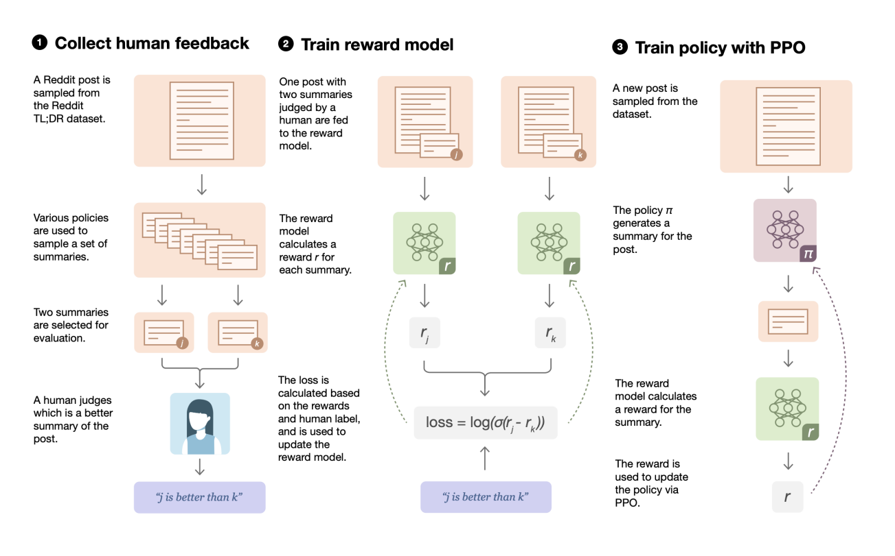
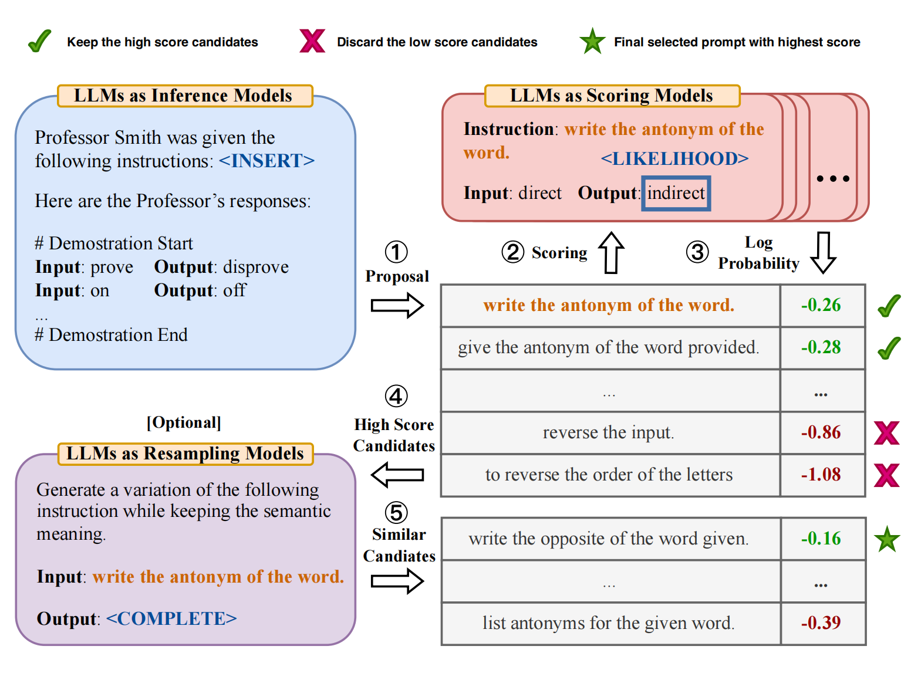

# KokoMind_Onboarding

This repo contains three parts for the onboarding part of [Kokomind project](https://chats-lab.github.io/KokoMind/).

## Content

1. [Requirements](#requirements)
2. [Download Data](#download-data)
3. [Run through RLHF](#run-through-RLHF)    
4. [Finetuning llama2-based paraphrase model with peft](#finetuning-llama2)
5. [automatic prompt engineer](#automatic_prompt_engineer)
6. [Ghost Attention in llama2](#Ghost-Attention-in-llama2)
7. [Contact](#contact)

## Requirements

```
conda create -n llama python=3.10.12
conda activate llama
pip3 install -r requirements.txt --user
```
## Run through RLHF

[Source code](https://github.com/CarperAI/trlx) 

The process of RLHF can be separated in three parts:
<p align="center">
  
</p>

1. install trxl with command:
```
cd scripts/trxl
pip install -e .
```

2. Fine-tune with Supervision (SFT) running with:
```
!deepspeed examples/summarize_rlhf/sft/train_gptj_summarize.py
```

3. Train the Reward Model running with:
```
!deepspeed examples/summarize_rlhf/reward_model/train_reward_model_gptj.py
```

4. Fine-tune with PPO running with:
```
!deepspeed examples/summarize_rlhf/trlx_gptj_text_summarization.py
```
## Finetuning llama2-based paraphrase model with peft 

[Source code](https://github.com/huggingface/trl) 

You can fine-tune llama2-based model using command:
```
cd scripts/peft
python llama_peft.py \
    --model_name $MODEL \
    --dataset_name $DATASET \
    --load_in_4bit \
    --use_peft \
    --batch_size 4 \
    --gradient_accumulation_steps 2
```

For example:
```
python llama_peft.py \
    --model_name meta-llama/Llama-2-7b-hf \
    --dataset_name humarin/chatgpt-paraphrases \
    --load_in_4bit \
    --use_peft \
    --batch_size 4 \
    --gradient_accumulation_steps 2
```
## Automatic Prompt Engineer

APE is a system for automatic instruction generation and selection

<p align="center">
  
</p>

[Source code](https://github.com/keirp/automatic_prompt_engineer) 

You can reproduce the results of Chat-gpt using command:
```
python experiments/run_instruction_induction.py --task=antonyms
python experiments/run_truthful_qa.py
```

## Ghost Attention in llama2(implementing)

Ghost Attention is a method to help the attention focus in a multi-stage process.

<p align="center">
  
</p>

### Still working on codes

## Contact

Please leave Github issues or contact Hongchao Fang at `fang.hong@northeastern.edu` for any questions.
